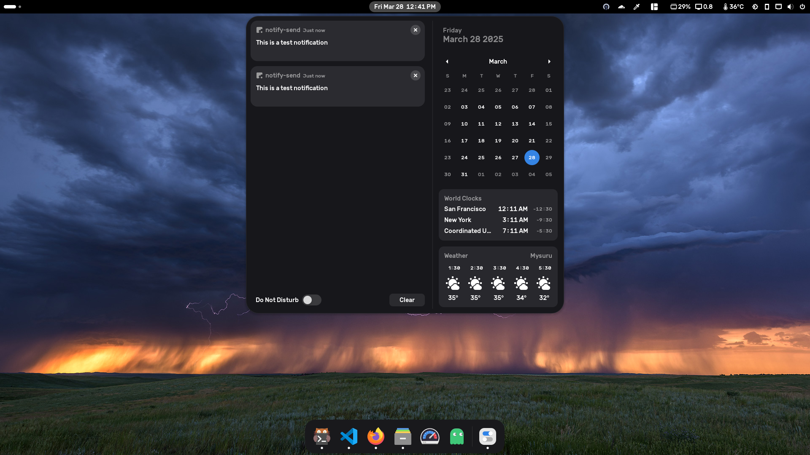
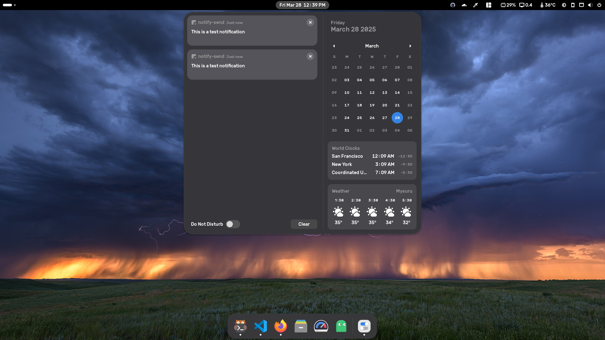

# Darkwaita
A darker version of the default Adwaita gnome-shell theme for Gnome 48. This is *ONLY* the gnome-shell theme.

> [!NOTE]  
> Updated for Gnome 48 Bengaluru 🎉

This was created by adding an offset to some of the gray colors in the original theme. Absolutely nothing else has been modified. The `gnome-shell` folder contains the modified theme (`gnome-shell.css`) and the unmodified theme (`gnome-shell.css.original`) which can easily be compared to see what has been changed.

## Installation
1. Clone this repository into `~/.local/share/themes`.
2. Select `Darkwaita` as the shell theme in gnome-tweaks.

## Dash-to-dock
Make sure to _turn off_ "Customize the dash color" in the dash-to-dock settings if you want it to match the Darkwaita theme.

## Screenshots
This is the Darkwaita theme in action.


This is the original Adwaita theme (Gnome 48). Gray color looks washed out.


## Getting the unmodified Gnome 48 Adwaita gnome-shell theme
If you are running Gnome 48, do:
```sh
mkdir /tmp/Adwaita && cd /tmp/Adwaita
cp /usr/share/gnome-shell/gnome-shell-theme.gresource .
for FILE in `gresource list gnome-shell-theme.gresource`; do gresource extract gnome-shell-theme.gresource $FILE > $(basename -- "$FILE"); done
```
